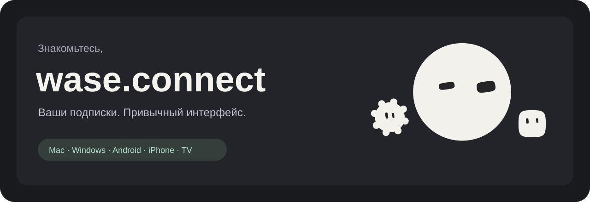

# Wase Connect

Один интерфейс для ваших VPN-подписок: серверы, избранное, маршрутизация и темы оформления.

[Загрузки](https://github.com/vlad1337vlad1337-droid/wase-connect-downloads/releases) · [Совместимость](docs/COMPATIBILITY.md) · [Установка](docs/INSTALL.md) · [Сообщить о проблеме](https://github.com/vlad1337vlad1337-droid/wase-connect-downloads/issues/new/choose) · [Wase Secure](https://waseworm.ru/sec)

## Загрузки

**Публичный стабильный выпуск готовится.** В этом разделе появятся установщики после проверки подписи и установки на целевых устройствах.

| Устройство | Формат | Доступность |
|---|---|---|
| Mac · Apple Silicon / Intel | Universal DMG | Готовится подпись Apple и проверка установки |
| Windows x64 | EXE | Идут проверки на настоящем Windows |
| Android | APK | Идут проверки на физических устройствах |
| Android TV / Google TV | APK | Идут проверки на телевизоре |
| iPhone / iPad | App Store / TestFlight | Готовится |
| Apple TV | App Store / TestFlight | В разработке |

Когда выпуск будет доступен, выбирайте установщик в **[Releases](https://github.com/vlad1337vlad1337-droid/wase-connect-downloads/releases)** под свою платформу. Автоматические архивы GitHub `Source code (zip / tar.gz)` содержат документацию этой страницы и **не устанавливают приложение**.

## В приложении

- Подписки из разных источников, отдельные группы серверов и избранное.
- Общий интерфейс, анимированные маскоты и светлая/тёмная тема с цветными акцентами.
- Автоматический выбор сервера и ручной выбор локации.
- Базовые действия на главном экране, дополнительные параметры — в профессиональных настройках.

Возможности отдельных платформ и форматов отличаются. [Матрица совместимости](docs/COMPATIBILITY.md) описывает текущие границы.

## Проверка загрузки

К каждому опубликованному выпуску прилагаются версия, изменения и `SHA256SUMS.txt`. macOS-выпуски должны проходить Developer ID/notarization и проверку установки скачанного DMG. Список проверок помогает проверить конкретный файл; он не является обещанием отсутствия любых ошибок или работы в любой сети.

## Обратная связь

[Создать обращение](https://github.com/vlad1337vlad1337-droid/wase-connect-downloads/issues/new/choose). Укажите версию приложения, систему, модель устройства и шаги воспроизведения. Не публикуйте ссылки подписок, UUID серверов, пароли или личные журналы.

Этот репозиторий содержит страницу загрузок, документацию и оформление. Исходники клиента хранятся отдельно в приватном репозитории. [Компоненты и лицензии](THIRD-PARTY-NOTICES.md).
